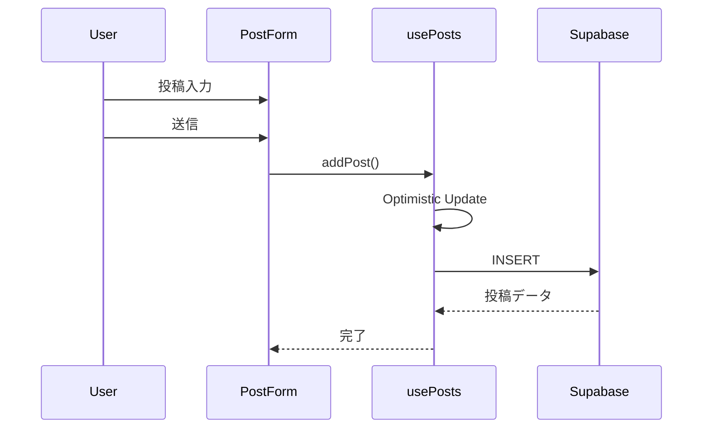
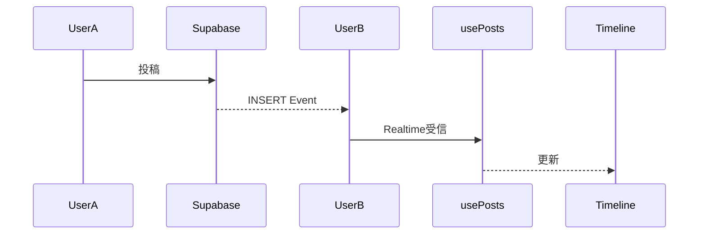
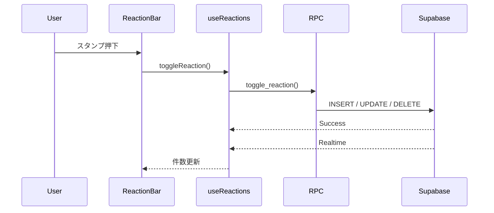
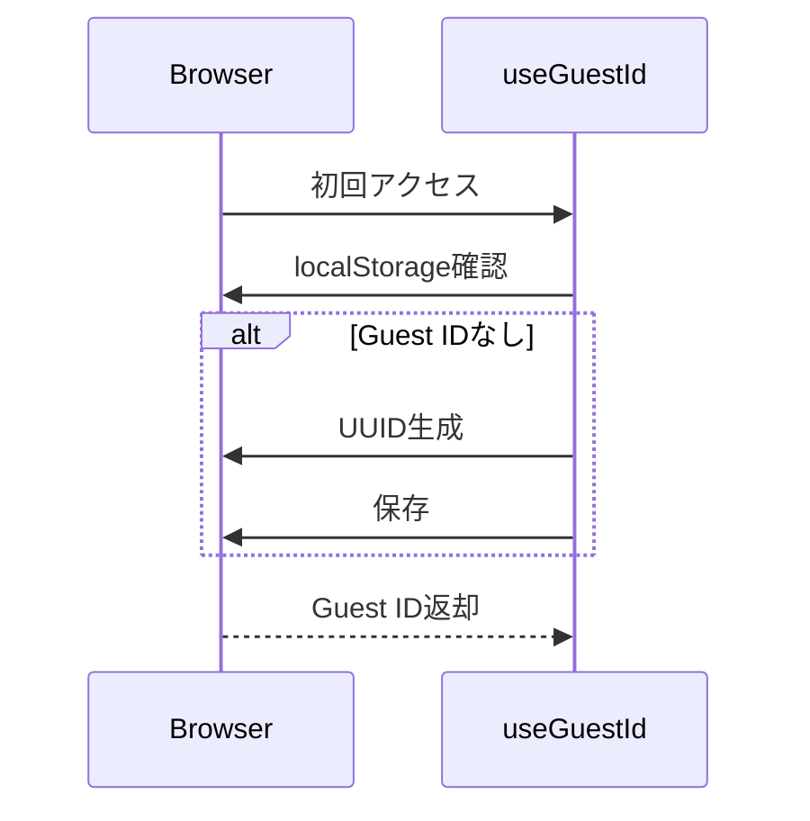

# 設計書
# 夜泣き・ワンオペ愚痴の駆け込み寺

---

# 1. プロジェクト概要

## 1.1 システム名称

**夜泣き・ワンオペ愚痴の駆け込み寺**

---

## 1.2 システム概要

「夜泣き・ワンオペ愚痴の駆け込み寺」は、
夜泣きやワンオペ育児で疲れた保護者が、
匿名で今の気持ちを吐き出せる投稿型Webアプリケーションである。

ユーザー登録は不要で、
初回アクセス時に生成される Guest ID によって匿名利用を実現する。

本サービスではコメント機能を設けず、
共感スタンプのみで気持ちを伝え合う。

投稿はリアルタイムで全利用者へ反映され、
毎朝6時に自動削除される。

---

## 1.3 開発目的

育児中は、

- 夜中に孤独を感じる
- SNSでは本音を書きづらい
- 誰にも相談できない

という状況が少なくない。

本サービスでは、

「今つらい」

という感情を短時間で吐き出し、

他の利用者から

「わかる」
「起きてるよ」

という共感だけを受け取ることで、
精神的負担を少しでも軽減することを目的とする。

---

## 1.4 コンセプト

> アドバイスはいらない。
>
> 今だけ誰かに聞いてほしい。

投稿は短文。

返信はない。

評価もない。

共感スタンプだけが返ってくる。

夜中でも静かにつながれる場所を目指す。

---

# 2. システムコンセプト

## 2.1 コンセプトキーワード

- 匿名
- 共感
- シンプル
- 安心
- 深夜向けUI
- モバイルファースト
- 軽量
- リアルタイム

---

## 2.2 設計思想

本サービスでは、

SNSのような承認欲求ではなく、

「安心して吐き出せること」

を最優先とする。

そのため以下の方針を採用する。

### 匿名性

- ユーザー登録なし
- Guest IDのみ保持
- 個人情報を扱わない

---

### シンプルさ

- 投稿は140文字以内
- コメントなし
- 画像投稿なし

---

### 共感重視

返信ではなく、

共感スタンプのみ送信できる。

---

### ネガティブ体験を作らない

以下の機能は実装しない。

- フォロー
- ランキング
- いいね順位
- 通知
- コメント

---

### モバイルファースト

スマートフォンでの利用を前提とし、

- 最大幅480px
- 下部固定投稿フォーム
- 片手操作しやすいUI

を採用する。

---

# 3. 機能要件

## 3.1 投稿機能

利用者は140文字以内で投稿できる。

### 要件

- 空文字は禁止
- 前後空白のみは禁止
- 最大140文字
- 二重送信防止
- Optimistic Update
- 投稿成功後は入力欄をクリア

---

## 3.2 投稿一覧

投稿は新しい順で表示する。

### 要件

- created_at DESC
- 最大100件取得
- Skeleton Loader表示
- Empty State表示

---

## 3.3 リアルタイム同期

Supabase Realtime を利用する。

### 要件

- 新規投稿同期
- 重複表示防止
- Temporary Post置換
- スタンプ同期

---

## 3.4 共感スタンプ

コメント機能の代替として利用する。

### スタンプ一覧

|表示|内部値|
|----|------|
|😮‍💨 お疲れ様|otsukare|
|🌙 起きてるよ|okiteru|
|🥹 わかる|wakaru|
|🫂 泣きな|naiteru|
|💪 がんばれ|ganbare|

### 要件

- 1投稿1スタンプ
- 同じスタンプで解除
- 別スタンプで変更
- 件数表示
- Realtime同期
- RPC経由で更新

---

## 3.5 ゲスト管理

ユーザー登録は行わない。

### 要件

- UUID生成
- localStorage保存
- 再訪問時も同一Guest ID利用

---

## 3.6 毎朝リセット

毎朝6時に投稿・スタンプを削除する。

### 要件

- pg_cron利用
- post_reactions削除
- posts削除

---

# 4. 機能一覧

|機能|概要|状態|
|----|----|----|
|投稿|140文字投稿|✅|
|投稿一覧|タイムライン表示|✅|
|Optimistic Update|即時反映|✅|
|Realtime|投稿同期|✅|
|Guest ID|匿名利用|✅|
|共感スタンプ|追加・変更・解除|✅|
|Realtimeスタンプ|同期|✅|
|RPC|toggle_reaction()利用|✅|
|毎朝6時削除|pg_cron|✅|
|コメント|実装しない|－|
|画像投稿|実装しない|－|
|認証|実装しない|－|

---

# 5. 画面設計

## 5.1 画面構成

```

┌──────────────────────┐

🌙 夜泣き・ワンオペ愚痴の駆け込み寺

今だけ吐き出そう

──────────────────────

投稿カード

投稿カード

投稿カード

──────────────────────

投稿フォーム

送信ボタン

└──────────────────────┘

```

---

## 5.2 コンポーネント構成

```

Home

├── Header

├── Timeline

│

├── PostCard

│

└── ReactionBar

│

└── PostForm

```

---

## 5.3 投稿カード

表示項目

- 投稿本文
- 投稿日時（○分前）
- 共感スタンプ
- スタンプ合計数

カードデザイン

- ダークテーマ
- Rounded XL
- Hover Shadow
- モバイル最適化

---

## 5.4 投稿フォーム

表示項目

- テキストエリア
- 残文字数
- 送信ボタン

仕様

- 画面下固定
- Safe Area対応
- 入力中スクロール防止
- フォーカスリング表示
- aria-label設定

---

## 5.5 共感スタンプ

表示内容

😮‍💨 お疲れ様

🌙 起きてるよ

🥹 わかる

🫂 泣きな

💪 がんばれ

仕様

- 1投稿につき1つのみ
- 再タップで解除
- ボタンサイズ44px以上
- hoverアニメーション
- activeアニメーション
- aria-pressed対応
- aria-label対応

┌─────────────────────────────┐
│          Browser            │
│ (Chrome / Safari / Edge)    │
└────────────┬────────────────┘
             │
             ▼
┌─────────────────────────────┐
│ Next.js 15 (App Router)     │
│ React 19 + TypeScript       │
└────────────┬────────────────┘
             │
             ▼
┌─────────────────────────────┐
│ Custom Hooks                │
│                             │
│ useGuestId                  │
│ usePosts                    │
│ useReactions                │
└────────────┬────────────────┘
             │
             ▼
┌─────────────────────────────┐
│ Supabase JavaScript SDK     │
│ (Singleton Client)          │
└────────────┬────────────────┘
             │
             ▼
┌─────────────────────────────┐
│ Supabase                    │
│                             │
│ PostgreSQL                  │
│ Realtime                    │
│ RPC(Function)               │
│ Row Level Security          │
└─────────────────────────────┘

# 11. 処理フロー

## 11.1 初回表示

### 処理概要

アプリ起動時に Guest ID を取得し、投稿一覧を読み込む。

### 処理フロー

```text
アプリ起動
        │
        ▼
useGuestId()
        │
        ▼
localStorage確認
        │
        ▼
Guest ID取得（存在しない場合はUUID生成）
        │
        ▼
usePosts()
        │
        ▼
投稿一覧取得
        │
        ▼
Timeline表示
        │
        ▼
Realtime購読開始
```

---

## 11.2 投稿送信

### 処理概要

投稿は Optimistic Update により即座に画面へ反映される。

### 処理フロー

```text
投稿入力
        │
        ▼
送信ボタン押下
        │
        ▼
入力チェック
        │
        ▼
Optimistic Post生成(temp-UUID)
        │
        ▼
Timelineへ追加
        │
        ▼
Supabase INSERT
        │
        ├───────────────┐
        ▼               ▼
     成功             失敗
        │               │
        ▼               ▼
実データへ置換     temp投稿削除
```

---

## 11.3 投稿Realtime同期

### 処理概要

Realtime INSERT を購読し、新しい投稿を即時反映する。

### 処理フロー

```text
Supabase
        │
        ▼
Realtime INSERT
        │
        ▼
重複チェック
        │
        ▼
temp投稿なら置換
        │
        ▼
Timeline更新
```

---

## 11.4 共感スタンプ

### 処理概要

スタンプ処理は PostgreSQL RPC により一括管理される。

### 処理フロー

```text
ReactionBar
        │
        ▼
toggleReaction()
        │
        ▼
Supabase RPC
(toggle_reaction)
        │
        ▼
PostgreSQL
        │
        ├───────────────┐
        ▼               ▼
INSERT/UPDATE/DELETE 判定
        │
        ▼
Realtime
        │
        ▼
useReactions()
        │
        ▼
ReactionBar更新
```

---

## 11.5 Realtime（スタンプ）

### 処理概要

スタンプ変更は post_reactions の Realtime を利用して同期する。

```text
UserA
        │
        ▼
RPC実行
        │
        ▼
post_reactions更新
        │
        ▼
Realtime
        │
        ▼
UserB
        │
        ▼
fetchReactions()
        │
        ▼
件数更新
```

---

## 11.6 毎朝6時自動削除

### 処理概要

pg_cron により毎朝投稿をリセットする。

```text
pg_cron
        │
        ▼
DELETE posts
        │
        ▼
ON DELETE CASCADE
        │
        ▼
post_reactions削除
        │
        ▼
Realtime通知
        │
        ▼
Timeline更新
```

---

# 12. シーケンス図

## 12.1 投稿送信



---

## 12.2 投稿Realtime



---

## 12.3 共感スタンプ



---

## 12.4 Guest ID



---

# 13. ディレクトリ構成

```text
src
├── app
│   ├── globals.css
│   ├── layout.tsx
│   └── page.tsx
│
├── components
│   ├── PostForm.tsx
│   ├── Timeline.tsx
│   ├── PostCard.tsx
│   └── ReactionBar.tsx
│
├── hooks
│   ├── useGuestId.ts
│   ├── usePosts.ts
│   └── useReactions.ts
│
├── lib
│   └── supabase
│       └── client.ts
│
└── types
    └── index.ts
```

---

## ディレクトリ方針

### app

- 画面レイアウト
- ページ構成
- グローバルCSS

---

### components

UI表示のみ担当する。

データ取得は Hook へ委譲する。

---

### hooks

ビジネスロジックを担当する。

- 投稿取得
- 投稿追加
- Guest ID管理
- Realtime同期
- RPC呼び出し

---

### lib

Supabaseクライアントを Singleton として管理する。

---

### types

共通型を一元管理する。

---

# 14. 実装方針

## 14.1 コンポーネント設計

UI とロジックを完全に分離する。

### UI

- Home
- Timeline
- PostCard
- ReactionBar
- PostForm

---

### Hook

- usePosts
- useGuestId
- useReactions

---

## 14.2 State管理

React Context は利用しない。

必要最小限の useState を採用する。

---

## 14.3 データ取得

投稿

```
usePosts()
```

スタンプ

```
useReactions()
```

Guest ID

```
useGuestId()
```

---

## 14.4 Optimistic Update

投稿は即時画面反映する。

通信成功後に temp投稿 を実データへ置換する。

通信失敗時は temp投稿 を削除する。

---

## 14.5 Realtime

投稿

- INSERT購読

スタンプ

- post_reactions購読

重複データは排除する。

---

## 14.6 RPC

スタンプ追加・変更・解除は

```
toggle_reaction()
```

RPCへ集約する。

フロント側では INSERT / UPDATE / DELETE を判定しない。

---

## 14.7 エラーハンドリング

開発中のみ

```
console.error()
```

投稿失敗時のみ

```
alert()
```

を表示する。

---

## 14.8 パフォーマンス

- 投稿取得100件
- Optimistic Update
- Realtime同期
- useCallback利用
- Singleton Supabase Client
- 不要な再描画を抑制

---

## 14.9 UI方針

- モバイルファースト
- ダークテーマ
- 最大幅480px
- 固定ヘッダー
- 固定投稿フォーム
- タイムラインのみスクロール
- 押しやすいスタンプボタン（44px以上）
- Skeleton Loader
- アクセシビリティ対応（aria-label・aria-pressed等）

# 15. Supabase設定

## 15.1 使用テーブル

本システムでは以下のテーブルを利用する。

- posts
- post_reactions

---

## 15.2 Realtime

Realtime対象テーブル

- posts
- post_reactions

Publication

```
supabase_realtime
```

Realtimeを利用することで、

- 投稿追加
- 共感スタンプ追加
- 共感スタンプ変更
- 共感スタンプ解除

をリアルタイムで同期する。

---

## 15.3 RPC

スタンプ操作は PostgreSQL Function を利用する。

関数名

```
toggle_reaction()
```

責務

- INSERT
- UPDATE
- DELETE

の判定をデータベース側で行う。

クライアント側では状態判定を持たない。

---

## 15.4 Row Level Security

RLS を有効化する。

対象テーブル

- posts
- post_reactions

許可する操作

|操作|許可|
|----|----|
|SELECT|〇|
|INSERT|〇|
|UPDATE|〇|
|DELETE|〇|

RPC実行権限も付与する。

---

## 15.5 自動削除

Supabase pg_cron を利用する。

実行時刻

```
毎朝06:00
```

削除対象

```
posts
```

関連するスタンプは

```
ON DELETE CASCADE
```

により自動削除される。

---

## 15.6 環境変数

```
NEXT_PUBLIC_SUPABASE_URL

NEXT_PUBLIC_SUPABASE_ANON_KEY
```

---

## 15.7 接続ライブラリ

```
@supabase/supabase-js
```

Singleton Client として利用する。

---

## 15.8 セキュリティ方針

- Service Role Key は利用しない
- Anon Key のみ公開
- RLSによるアクセス制御
- Guest ID による匿名識別
- RPC経由でスタンプ更新

---

# 16. セキュリティ設計

## 16.1 基本方針

本システムは匿名利用を前提とする。

個人情報は保持しない。

認証機能も実装しない。

---

## 16.2 Guest ID

Guest ID は UUID を利用する。

保存先

```
localStorage
```

目的

- 同一利用者判定
- 共感スタンプ重複防止

Guest ID は個人情報ではない。

---

## 16.3 保存しない情報

以下は保存しない。

- 氏名
- メールアドレス
- 電話番号
- 生年月日
- SNSアカウント

アプリケーション側では IP アドレスも保持しない。

---

## 16.4 入力制限

投稿本文

- 最大140文字
- 空文字禁止
- trim() による前後空白除去

スタンプ

以下のみ許可する。

- otsukare
- okiteru
- wakaru
- naiteru
- ganbare

データベース側でも CHECK 制約により保証する。

---

## 16.5 SQLインジェクション対策

データ操作は

Supabase JavaScript SDK

および

RPC

のみを利用する。

文字列連結によるSQL実行は行わない。

---

## 16.6 XSS対策

React のエスケープ機能を利用する。

HTMLとして描画するAPI

```
dangerouslySetInnerHTML
```

は使用しない。

---

## 16.7 通信

Supabase SDK を利用する。

HTTPS通信のみを利用する。

---

## 16.8 エラー処理

通信エラー

- console.error（開発時）

投稿失敗

- alert表示

本番では

Sentry 等の導入を検討する。

---

# 17. 運用・保守方針

## 17.1 投稿運用

投稿は一時的な感情共有を目的とする。

毎朝6時に自動削除する。

長期間保存は行わない。

---

## 17.2 共感スタンプ

投稿削除時は

```
ON DELETE CASCADE
```

により自動削除される。

追加の削除処理は不要。

---

## 17.3 保守方針

責務分離を維持する。

```
UI

↓

Hook

↓

Supabase SDK

↓

RPC

↓

Database
```

新機能追加時もこの構成を維持する。

---

## 17.4 コーディングルール

### Component

1ファイル1責務

---

### Hook

```
use〇〇
```

命名とする。

---

### 型定義

```
src/types
```

へ集約する。

---

### Supabase

Singleton Client を利用する。

---

## 17.5 バージョン管理

Git を利用する。

推奨ブランチ

```
main

develop

feature/*
```

コミット例

```
feat: add optimistic update

feat: add reaction rpc

fix: duplicate reaction bug

refactor: cleanup usePosts
```

---

## 17.6 障害対応

障害発生時は

1. エラーログ確認
2. Supabaseログ確認
3. Realtime状態確認
4. RLS確認
5. RPC確認

の順で調査する。

---

## 17.7 将来的な改善候補

- Sentry
- LogRocket
- E2Eテスト
- CI/CD
- GitHub Actions

---

# 18. ロードマップ

## Phase 1（MVP）

実装済み

- 投稿
- 投稿一覧
- Guest ID
- Realtime
- Optimistic Update

ステータス

```
完了
```

---

## Phase 2（共感スタンプ）

実装済み

- ReactionBar
- useReactions
- RPC
- Realtime同期
- スタンプ件数表示
- 自分のスタンプ表示

ステータス

```
完了
```

---

## Phase 3（UI/UX改善）

実装済み

- ダークテーマ
- グラデーション背景
- モバイルUI
- 固定ヘッダー
- 固定投稿フォーム
- タイムラインスクロール
- Skeleton Loader
- アニメーション
- アクセシビリティ対応

ステータス

```
完了
```

---

## Phase 4（今後の改善候補）

- NGワードフィルタ
- 通報機能
- スパム対策
- 投稿レート制限
- PWA対応
- オフライン対応

---

## Phase 5（運用強化）

- 管理画面
- 投稿数ダッシュボード
- Analytics
- Sentry導入
- GitHub Actions

---

## 18.1 テスト方針

リリース前には以下を確認する。

- 投稿
- 投稿削除（Cron）
- Realtime
- Optimistic Update
- Guest ID保持
- スタンプ追加
- スタンプ変更
- スタンプ解除
- RPC動作
- モバイル表示
- Safari動作
- Chrome動作

---

## 18.2 開発方針

本システムは

「小さく作り、継続的に改善する」

ことを基本方針とする。

複雑な機能を増やすよりも、

利用者が安心して短時間で使える体験を優先する。

---

## 18.3 設計思想

本アプリで最も重要なのは、

「安心して気持ちを吐き出せる場所」

である。

そのため今後も以下を最優先とする。

- 匿名で利用できること
- 誰かを評価しないこと
- コメント機能を追加しないこと
- 共感だけが返ってくること
- 深夜でも静かに利用できること
- シンプルな操作性を維持すること

---

## 18.4 更新履歴

|バージョン|内容|
|-----------|----|
|0.1|設計書作成|
|0.2|Realtime対応|
|0.3|朝6時自動削除追加|
|0.4|共感スタンプ設計追加|
|1.0|MVP完成|
|2.0|実装完全準拠版へ全面更新（Optimistic Update・Realtime・RPC・UI/UX改善・アクセシビリティ対応）|

