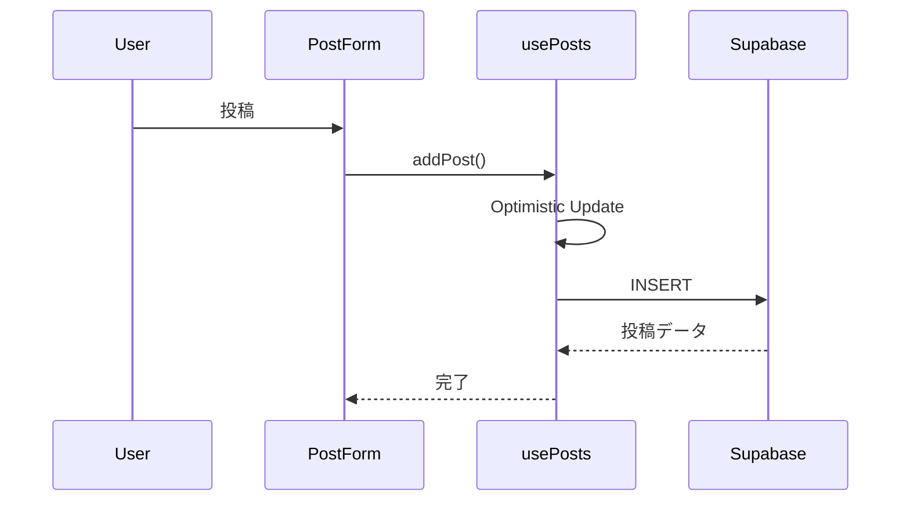
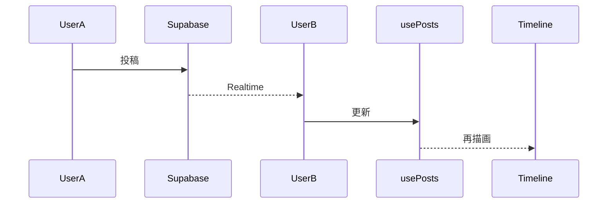
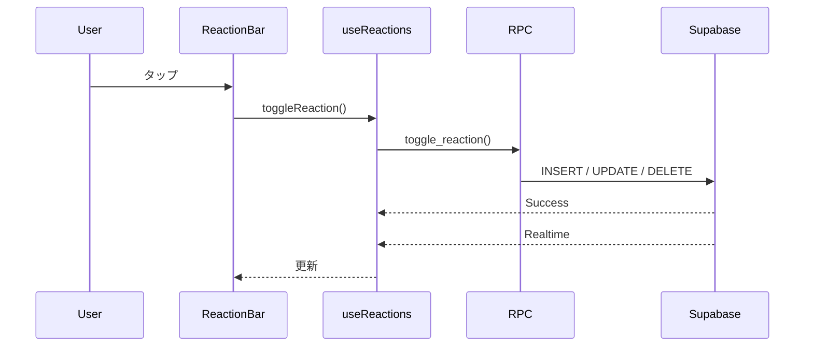
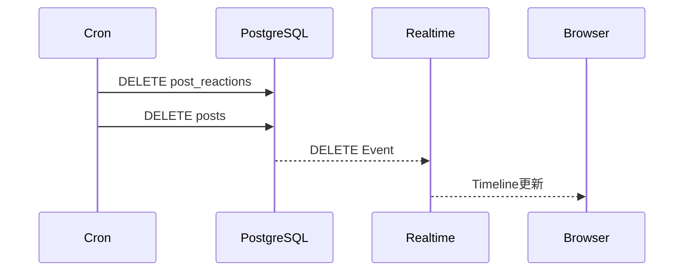
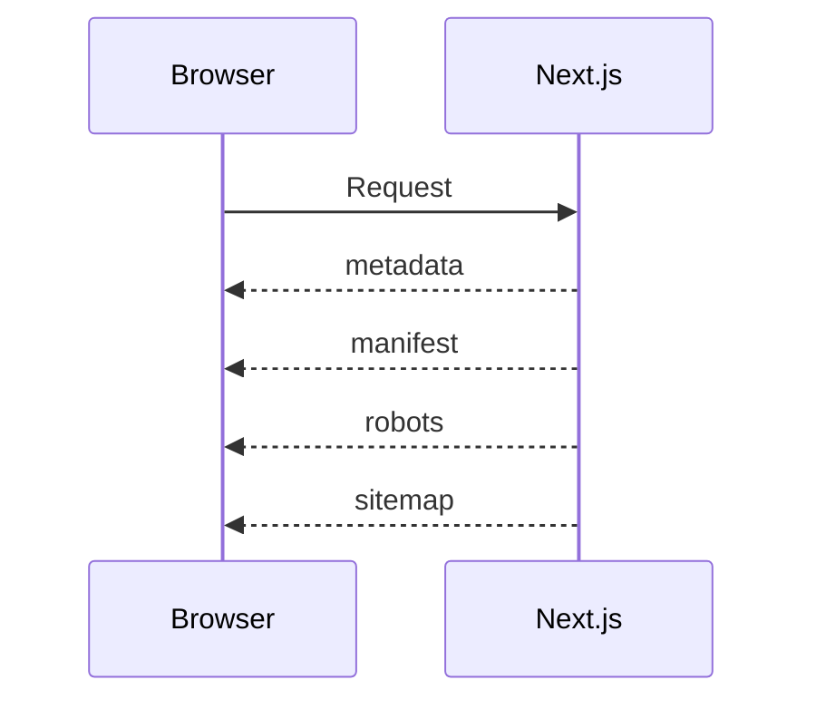

# 設計書
# 夜泣き・ワンオペ愚痴の駆け込み寺

---

# 1. プロジェクト概要

## 1.1 システム名称

**夜泣き・ワンオペ愚痴の駆け込み寺**

---

## 1.2 システム概要

「夜泣き・ワンオペ愚痴の駆け込み寺」は、
夜泣きやワンオペ育児で疲れた保護者が、
匿名で今の気持ちを安心して吐き出せるWebアプリケーションである。

ユーザー登録やログインは不要で、
初回アクセス時に生成される Guest ID により匿名利用を実現する。

投稿にはコメント機能を設けず、
共感リアクションのみで気持ちを伝え合う設計としている。

投稿・リアクションは Supabase Realtime によりリアルタイム同期され、
毎朝6時に自動削除される。

---

## 1.3 開発目的

育児中は、

- 夜泣きで眠れない
- ワンオペで孤独を感じる
- SNSでは本音を書きづらい
- 誰かに少しだけ共感してほしい

という状況が少なくない。

本サービスでは、

「今つらい」

という感情を短時間で吐き出し、

他の利用者から

- お疲れさま
- 起きてるよ
- わかる

という共感だけを受け取ることで、
少しでも気持ちを軽くできる場所を目指す。

---

## 1.4 コンセプト

> アドバイスはいらない。
>
> 今だけ誰かに聞いてほしい。

投稿は短文。

返信はない。

評価もない。

共感リアクションだけが返ってくる。

深夜でも安心して利用できる、
静かな場所を目指す。

---

## 1.5 開発方針

本プロジェクトでは以下を基本方針とする。

- スマホファースト
- シンプルなUI
- 保守性重視
- アクセシビリティ重視
- App Router準拠
- 不要なライブラリを追加しない
- 責務分離を徹底する

---

# 2. システムコンセプト

## 2.1 コンセプトキーワード

- 匿名
- 共感
- シンプル
- 安心
- 深夜向け
- モバイルファースト
- リアルタイム
- 軽量

---

## 2.2 設計思想

本サービスでは、

SNSのような承認欲求ではなく、

「安心して吐き出せること」

を最優先とする。

---

### 匿名性

- ログイン不要
- Guest IDのみ保持
- 個人情報を保持しない

---

### シンプルさ

- 投稿140文字以内
- コメントなし
- 画像投稿なし
- ユーザー検索なし

---

### 共感重視

返信ではなく、

共感リアクションのみ送信できる。

---

### ネガティブ体験を作らない

以下の機能は実装しない。

- コメント
- フォロー
- ランキング
- 通知
- DM

---

### モバイルファースト

スマートフォン利用を前提とする。

- 最大幅480px
- 固定ヘッダー
- 固定投稿フォーム
- タイムラインのみスクロール
- Safe Area対応

---

### アクセシビリティ

誰でも利用しやすいUIを目指す。

- Skip Link
- aria-label
- aria-live
- aria-modal
- semantic HTML
- キーボード操作対応

---

# 3. 機能要件

## 3.1 投稿機能

利用者は140文字以内で投稿できる。

### 要件

- 空文字禁止
- trim()実施
- 最大140文字
- 二重送信防止
- Optimistic Update
- 投稿後入力クリア

---

## 3.2 タイムライン

投稿は新しい順で表示する。

### 要件

- created_at DESC
- 最大100件取得
- Skeleton Loader
- Empty State
- Realtime同期

---

## 3.3 リアルタイム同期

Supabase Realtime を利用する。

### 要件

- 投稿同期
- リアクション同期
- 重複表示防止
- Optimistic Post置換

---

## 3.4 共感リアクション

コメント機能の代替として利用する。

### リアクション一覧

|表示|内部値|
|----|------|
|😮‍💨 お疲れさま|otsukare|
|🌙 起きてるよ|okiteru|
|🥹 わかる|wakaru|
|🫂 泣きな|naiteru|
|💪 がんばれ|ganbare|

### 要件

- 1投稿につき1リアクション
- 同一リアクションで解除
- 別リアクションへ変更可能
- 件数表示
- Realtime同期
- RPC経由で更新

---

## 3.5 Guest ID

ユーザー登録は行わない。

### 要件

- UUID生成
- localStorage保存
- 再訪問時も同じIDを利用

---

## 3.6 投稿自動削除

毎朝6時に投稿を削除する。

### 要件

- pg_cron利用
- post_reactions削除
- posts削除
- Realtime反映

---

## 3.7 オープニング表示

初回アクセス時のみ表示する。

### 要件

- 初回のみ表示
- localStorage管理
- フェードイン・フェードアウト
- スクロール禁止

---

## 3.8 利用規約・プライバシーポリシー

フッターから閲覧できる。

### 要件

- App Router対応
- Footer常設
- Linkコンポーネント利用

---

# 4. 機能一覧

|機能|概要|状態|
|----|----|----|
|匿名投稿|140文字投稿|✅|
|タイムライン|一覧表示|✅|
|Optimistic Update|即時反映|✅|
|Realtime投稿|同期|✅|
|Guest ID|匿名利用|✅|
|共感リアクション|追加・変更・解除|✅|
|Realtimeリアクション|同期|✅|
|RPC|toggle_reaction()|✅|
|毎朝6時削除|pg_cron|✅|
|オープニング画面|初回表示|✅|
|利用規約|表示|✅|
|プライバシーポリシー|表示|✅|
|Skip Link|アクセシビリティ|✅|
|SEO対応|metadata等|✅|
|OGP対応|SNS共有|✅|
|コメント|実装しない|－|
|画像投稿|実装しない|－|
|認証|実装しない|－|

---

# 5. 画面設計

## 5.1 画面構成

```text
┌────────────────────────────┐
│ 🌙 夜泣き・ワンオペ愚痴の駆け込み寺 │
├────────────────────────────┤
│                            │
│        タイムライン         │
│                            │
│   ┌──────────────────┐     │
│   │ 投稿カード        │     │
│   └──────────────────┘     │
│                            │
│   ┌──────────────────┐     │
│   │ 投稿カード        │     │
│   └──────────────────┘     │
│                            │
├────────────────────────────┤
│ 投稿フォーム               │
│────────────────────────────│
│ 利用規約｜プライバシーポリシー │
└────────────────────────────┘
```

---

## 5.2 コンポーネント構成

```text
Home
├── OpeningOverlay
├── Header
├── Timeline
│   └── PostCard
│       └── ReactionBar
├── PostForm
└── Footer
    ├── Terms Link
    └── Privacy Link
```

---

## 5.3 投稿カード

表示項目

- 投稿本文
- 投稿日時
- 共感リアクション
- リアクション件数

デザイン

- ダークテーマ
- Rounded XL
- Shadow
- モバイル最適化

---

## 5.4 投稿フォーム

表示項目

- テキストエリア
- 残文字数
- 投稿ボタン

仕様

- 下部固定
- Safe Area対応
- aria-label対応
- 二重送信防止

---

## 5.5 共感リアクション

表示内容

- 😮‍💨 お疲れさま
- 🌙 起きてるよ
- 🥹 わかる
- 🫂 泣きな
- 💪 がんばれ

仕様

- 1投稿1リアクション
- 再タップで解除
- RPC経由
- Realtime同期
- aria-pressed対応
- PCクリック・スマホ長押し対応

---

## 5.6 オープニング画面

初回アクセス時のみ表示する。

表示内容

- メッセージアニメーション
- フェードイン
- フェードアウト

localStorage により一度だけ表示する。

---

## 5.7 フッター

表示項目

- 利用規約
- プライバシーポリシー

Next.js Link を利用し、
App Router の画面遷移を行う。

# 6. システム構成

## 6.1 全体構成

```text
┌─────────────────────────────┐
│ Browser                     │
│ Chrome / Safari / Edge      │
└────────────┬────────────────┘
             │
             ▼
┌─────────────────────────────┐
│ Next.js App Router          │
│ React + TypeScript          │
└────────────┬────────────────┘
             │
             ▼
┌─────────────────────────────┐
│ Custom Hooks                │
│                             │
│ useGuestId                  │
│ usePosts                    │
│ useReactions                │
└────────────┬────────────────┘
             │
             ▼
┌─────────────────────────────┐
│ Supabase JavaScript SDK     │
└────────────┬────────────────┘
             │
             ▼
┌─────────────────────────────┐
│ Supabase                    │
│                             │
│ PostgreSQL                  │
│ Realtime                    │
│ RPC                         │
│ pg_cron                     │
│ Row Level Security          │
└─────────────────────────────┘
```

---

## 6.2 使用サービス

|サービス|用途|
|---------|----|
|Next.js App Router|フロントエンド|
|Supabase PostgreSQL|データベース|
|Supabase Realtime|リアルタイム同期|
|Supabase RPC|リアクション処理|
|pg_cron|毎朝6時自動削除|
|Vercel|本番環境|

---

## 6.3 採用方針

- App Router を採用
- UI とロジックを分離
- Hook ベース設計
- Singleton Supabase Client
- Realtime による即時同期
- RPC によるリアクション処理集約
- 保守性を優先したシンプルな構成

---

# 7. データベース設計

## 7.1 posts テーブル

|列名|型|備考|
|----|----|----|
|id|uuid|PK|
|guest_id|uuid|匿名ユーザーID|
|body|text|投稿本文|
|created_at|timestamptz|投稿日時|

### インデックス

- posts_created_at_idx
- posts_guest_id_idx

---

## 7.2 post_reactions テーブル

|列名|型|備考|
|----|----|----|
|id|uuid|PK|
|post_id|uuid|FK(posts.id)|
|guest_id|text|匿名ユーザーID|
|reaction|text|リアクション種別|
|created_at|timestamptz|作成日時|

### インデックス

- unique_post_guest
- idx_post_reactions_post_id

---

## 7.3 外部キー

```text
posts
   │
   └──── id
          ▲
          │
post_reactions.post_id
```

投稿削除時は

```
ON DELETE CASCADE
```

によりリアクションも自動削除される。

---

## 7.4 Realtime

Realtime対象テーブル

- posts
- post_reactions

Publication

```
supabase_realtime
```

---

## 7.5 Cron

毎朝6時に以下を実行する。

```sql
DELETE FROM post_reactions;

DELETE FROM posts;
```

---

# 8. コンポーネント設計

## 8.1 コンポーネント構成

```text
Home
│
├── Header
├── Timeline
│
├── PostCard
│    └── ReactionBar
│
├── PostForm
│
└── Opening Overlay
```

---

## 8.2 Home

責務

- 全体レイアウト
- 投稿送信
- オープニング表示
- Footerリンク表示

---

## 8.3 Timeline

責務

- 投稿一覧表示
- Loading表示
- Empty State表示

---

## 8.4 PostCard

責務

- 投稿本文表示
- 投稿日時表示
- リアクション表示

---

## 8.5 ReactionBar

責務

- リアクション表示
- リアクション追加
- リアクション変更
- リアクション解除
- 長押し操作（スマホ）
- クリック操作（PC）

---

## 8.6 PostForm

責務

- 投稿入力
- バリデーション
- 投稿送信

---

# 9. Hook設計

## 9.1 useGuestId

責務

- UUID生成
- localStorage保存
- Guest ID取得

---

## 9.2 usePosts

責務

- 投稿取得
- 投稿追加
- Optimistic Update
- Realtime同期

---

## 9.3 useReactions

責務

- RPC呼び出し
- リアクション取得
- Realtime同期
- 件数更新
- 自分のリアクション管理

---

# 10. ディレクトリ構成

```text
src
├── app
│   ├── layout.tsx
│   ├── page.tsx
│   ├── manifest.ts
│   ├── robots.ts
│   ├── sitemap.ts
│   ├── privacy
│   │   └── page.tsx
│   └── terms
│       └── page.tsx
│
├── components
│   ├── PostForm.tsx
│   ├── Timeline.tsx
│   ├── PostCard.tsx
│   └── ReactionBar.tsx
│
├── hooks
│   ├── useGuestId.ts
│   ├── usePosts.ts
│   └── useReactions.ts
│
├── lib
│   └── supabase
│       └── client.ts
│
└── types
    └── index.ts

public
├── favicon.ico
├── icon.png
├── apple-icon.png
└── og-image.png
```

---

## ディレクトリ方針

### app

- 画面
- レイアウト
- SEO設定
- 利用規約
- プライバシーポリシー

---

### components

UIのみ担当する。

---

### hooks

ビジネスロジックを担当する。

---

### lib

Supabase Client を Singleton として管理する。

---

### types

共通型を一元管理する。

---

### public

favicon・OGP画像・PWAアイコンなどの静的ファイルを配置する。

# 11. 処理フロー

## 11.1 初回表示

### 処理概要

初回アクセス時に Guest ID を取得し、投稿一覧を読み込む。

### 処理フロー

```text
アプリ起動
        │
        ▼
useGuestId()
        │
        ▼
localStorage確認
        │
        ├───────────────┐
        │存在する        │存在しない
        ▼               ▼
Guest ID取得      UUID生成・保存
        │
        ▼
usePosts()
        │
        ▼
投稿一覧取得
        │
        ▼
Realtime購読開始
        │
        ▼
Timeline表示
```

---

## 11.2 投稿送信

### 処理概要

投稿は Optimistic Update により即座に画面へ反映される。

### 処理フロー

```text
投稿入力
        │
        ▼
送信
        │
        ▼
入力チェック
        │
        ▼
Optimistic Post生成
(temp-UUID)
        │
        ▼
Timelineへ追加
        │
        ▼
Supabase INSERT
        │
        ├──────────────┐
        ▼              ▼
成功             エラー
        │              │
        ▼              ▼
temp投稿置換     temp投稿削除
```

---

## 11.3 投稿Realtime

### 処理概要

Realtime により投稿を同期する。

### 処理フロー

```text
投稿追加
        │
        ▼
Realtime Event
        │
        ▼
重複チェック
        │
        ▼
Timeline更新
```

---

## 11.4 リアクション

### 処理概要

リアクション操作は RPC に集約する。

### 処理フロー

```text
ReactionBar
        │
        ▼
toggleReaction()
        │
        ▼
Supabase RPC
(toggle_reaction)
        │
        ▼
PostgreSQL
        │
        ├───────────────┐
        ▼               ▼
INSERT
UPDATE
DELETE
        │
        ▼
Realtime通知
        │
        ▼
useReactions()
        │
        ▼
ReactionBar更新
```

---

## 11.5 毎朝6時削除

### 処理概要

Cron により投稿をリセットする。

### 処理フロー

```text
pg_cron
        │
        ▼
DELETE post_reactions
        │
        ▼
DELETE posts
        │
        ▼
Realtime通知
        │
        ▼
Timeline更新
```

---

## 11.6 SEO

### 処理概要

Next.js Metadata API によりSEO情報を生成する。

```text
layout.tsx
        │
        ▼
metadata
        │
        ▼
title
description
OGP
Twitter Card
manifest
robots
sitemap
```

---

# 12. シーケンス図

## 12.1 投稿



---

## 12.2 投稿Realtime



---

## 12.3 リアクション



---

## 12.4 Cron



---

## 12.5 SEO



---

# 13. ディレクトリ構成

```text
src
├── app
│   ├── favicon.ico
│   ├── globals.css
│   ├── layout.tsx
│   ├── page.tsx
│   ├── manifest.ts
│   ├── robots.ts
│   ├── sitemap.ts
│   ├── privacy
│   │   └── page.tsx
│   └── terms
│       └── page.tsx
│
├── components
│   ├── PostCard.tsx
│   ├── PostForm.tsx
│   ├── ReactionBar.tsx
│   └── Timeline.tsx
│
├── hooks
│   ├── useGuestId.ts
│   ├── usePosts.ts
│   └── useReactions.ts
│
├── lib
│   └── supabase
│       └── client.ts
│
└── types
    └── index.ts

public
├── apple-icon.png
├── favicon.ico
├── icon.png
└── og-image.png
```

---

# 14. 実装方針

## 14.1 基本方針

- App Router採用
- Server Componentsを基本とする
- Client Componentは必要最小限
- UIとロジックを分離
- Hookへ責務を集約

---

## 14.2 State管理

使用するState

- useState
- useEffect

Contextは利用しない。

---

## 14.3 データ取得

投稿

```
usePosts()
```

リアクション

```
useReactions()
```

Guest ID

```
useGuestId()
```

---

## 14.4 Optimistic Update

投稿は通信完了を待たず表示する。

成功時

- 実データへ置換

失敗時

- 仮投稿削除

---

## 14.5 Realtime

Realtime対象

- posts
- post_reactions

---

## 14.6 RPC

リアクション更新は

```
toggle_reaction()
```

のみを利用する。

INSERT / UPDATE / DELETE の判定はDB側で行う。

---

## 14.7 エラーハンドリング

開発時

```
console.error()
```

投稿失敗時

```
alert()
```

---

## 14.8 パフォーマンス

- Optimistic Update
- Realtime
- Singleton Client
- 必要最小限の再描画
- インデックス最適化

---

## 14.9 アクセシビリティ

対応項目

- Skip Link
- aria-label
- aria-live
- aria-modal
- aria-hidden
- aria-pressed
- focus-visible
- キーボード操作

---

## 14.10 SEO

Next.js Metadata APIを利用する。

対応項目

- title
- description
- keywords
- OGP
- Twitter Card
- robots
- sitemap
- manifest
- favicon

---

# 15. Supabase設定

## 15.1 テーブル

利用テーブル

- posts
- post_reactions

---

## 15.2 Realtime

対象

- posts
- post_reactions

Publication

```
supabase_realtime
```

---

## 15.3 RPC

利用関数

```
toggle_reaction()
```

責務

- INSERT
- UPDATE
- DELETE

---

## 15.4 RLS

対象

- posts
- post_reactions

許可

|操作|許可|
|----|----|
|SELECT|〇|
|INSERT|〇|
|UPDATE|〇|
|DELETE|〇|

---

## 15.5 Cron

毎日

```
06:00
```

実行SQL

```sql
DELETE FROM post_reactions;

DELETE FROM posts;
```

---

## 15.6 インデックス

posts

- created_at
- guest_id

post_reactions

- post_id
- unique(post_id, guest_id)

---

## 15.7 環境変数

```
NEXT_PUBLIC_SUPABASE_URL

NEXT_PUBLIC_SUPABASE_ANON_KEY
```

---

## 15.8 セキュリティ

- Service Role Keyは使用しない
- Anon Keyのみ利用
- RLS有効
- RPC経由で更新
- HTTPS通信
- Guest IDによる匿名利用

# 15. Supabase設定

## 15.1 使用テーブル

本システムでは以下のテーブルを利用する。

- posts
- post_reactions

---

## 15.2 テーブル概要

### posts

投稿データを保持する。

|項目|内容|
|----|----|
|id|UUID|
|guest_id|投稿者識別用UUID|
|body|投稿本文（140文字以内）|
|created_at|投稿日時|

---

### post_reactions

共感リアクションを保持する。

|項目|内容|
|----|----|
|id|UUID|
|post_id|投稿ID|
|guest_id|リアクションした利用者|
|reaction|リアクション種別|
|created_at|リアクション日時|

1ユーザーにつき1投稿1リアクションとなるよう、

# 16. セキュリティ設計

## 16.1 基本方針

本システムは匿名利用を前提としたWebアプリケーションである。

利用者登録は行わず、必要最小限の情報のみを保持する。

個人情報の収集を目的とせず、安全かつシンプルな構成を維持する。

---

## 16.2 匿名利用（Guest ID）

利用者識別には UUID を利用する。

保存先

- localStorage

用途

- 投稿者識別
- リアクション重複防止

Guest ID は認証情報ではなく、匿名利用のための識別子として扱う。

---

## 16.3 保存する情報

保持する情報は以下のみとする。

### posts

- id
- guest_id
- body
- created_at

### post_reactions

- id
- post_id
- guest_id
- reaction
- created_at

---

## 16.4 保存しない情報

以下の情報は保持しない。

- 氏名
- メールアドレス
- パスワード
- 電話番号
- 生年月日
- SNSアカウント
- 住所

アプリケーション側では IP アドレスも保存しない。

---

## 16.5 入力制限

投稿本文

- 最大140文字
- 空文字禁止
- trim() による前後空白除去

リアクション

許可値

- otsukare
- okiteru
- wakaru
- naiteru
- ganbare

DB側でも CHECK 制約により保証する。

---

## 16.6 データベース保護

### Row Level Security

以下のテーブルで RLS を有効化する。

- posts
- post_reactions

公開ポリシー

|テーブル|SELECT|INSERT|UPDATE|DELETE|
|---------|------|------|------|------|
|posts|〇|〇|-|-|
|post_reactions|〇|〇|〇|〇|

---

## 16.7 RPC

リアクション更新は

```
toggle_reaction()
```

のみを利用する。

クライアント側では

- INSERT
- UPDATE
- DELETE

の判定を行わない。

DB側で一元管理することで保守性を高める。

---

## 16.8 SQLインジェクション対策

データ操作は

- Supabase JavaScript SDK
- PostgreSQL RPC

のみを利用する。

文字列連結によるSQL実行は行わない。

---

## 16.9 XSS対策

React の自動エスケープ機能を利用する。

以下は使用しない。

```
dangerouslySetInnerHTML
```

投稿本文は文字列として表示する。

---

## 16.10 通信

通信は HTTPS を前提とする。

Supabase SDK を利用することで安全に通信する。

---

## 16.11 環境変数

公開する環境変数

```
NEXT_PUBLIC_SUPABASE_URL

NEXT_PUBLIC_SUPABASE_ANON_KEY
```

Service Role Key はフロントエンドで使用しない。

---

## 16.12 Realtime

Realtime対象

- posts
- post_reactions

Publication

```
supabase_realtime
```

リアルタイム同期は公開情報のみとする。

---

## 16.13 自動削除

毎朝6時に

```
pg_cron
```

により

```
DELETE FROM post_reactions;

DELETE FROM posts;
```

を実行する。

投稿を長期間保存しない運用とする。

---

## 16.14 エラーハンドリング

開発中

```
console.error()
```

投稿失敗時

```
alert()
```

本番運用では必要に応じてログ監視サービスの導入を検討する。

---

# 17. 運用・保守方針

## 17.1 基本方針

本システムは

「小さく、安全に、保守しやすく」

を基本方針とする。

責務分離を維持し、過度な複雑化を避ける。

---

## 17.2 アーキテクチャ

```
UI
 ↓
Hooks
 ↓
Supabase SDK
 ↓
RPC
 ↓
Database
```

この責務分離を維持する。

---

## 17.3 ディレクトリ構成

```
src
├── app
├── components
├── hooks
├── lib
├── types
└── public
```

役割を混在させない。

---

## 17.4 UI設計

以下を維持する。

- スマホファースト
- 最大幅480px
- ダークテーマ
- 固定ヘッダー
- 固定投稿フォーム
- タイムラインのみスクロール

---

## 17.5 投稿運用

投稿は毎朝6時に削除する。

長期間の保存は行わない。

匿名で気軽に利用できることを優先する。

---

## 17.6 リアクション運用

1投稿につき1リアクションのみ許可する。

変更・解除は RPC により管理する。

投稿削除時は

```
ON DELETE CASCADE
```

により関連データを削除する。

---

## 17.7 Realtime運用

Realtime は

- posts
- post_reactions

のみ利用する。

不要な購読は追加しない。

---

## 17.8 Cron運用

毎朝6時

```
DELETE FROM post_reactions;

DELETE FROM posts;
```

を実行する。

定期的に pg_cron Job を確認する。

---

## 17.9 コーディングルール

### Component

- 1ファイル1責務

### Hooks

```
use〇〇
```

命名を採用する。

### 型

```
src/types
```

へ集約する。

### Supabase

Singleton Client を利用する。

---

## 17.10 バージョン管理

Git を利用する。

推奨ブランチ

```
main

develop

feature/*
```

コミット例

```
feat: add realtime reaction

feat: add footer links

fix: duplicate optimistic update

refactor: cleanup usePosts
```

---

## 17.11 障害対応

障害発生時は以下の順で確認する。

1. ブラウザ Console
2. Network
3. Supabase Logs
4. Realtime
5. RPC
6. RLS
7. Cron

---

## 17.12 Lighthouse運用

公開前に以下を確認する。

|項目|目標|
|----|----:|
|Performance|95以上|
|Accessibility|100|
|Best Practices|100|
|SEO|100|

---

## 17.13 SEO運用

以下を管理する。

- metadata
- manifest
- robots
- sitemap
- OGP画像
- favicon
- Apple Touch Icon
- Twitter Card

ドメイン変更時は

- sitemap
- robots
- metadataBase

を更新する。

---

## 17.14 今後の改善候補

Ver.1.1以降で検討する。

- guest_id 型統一（uuid → text）
- Rate Limit
- NGワードフィルタ
- 通報機能
- PWA
- Analytics
- Sentry
- GitHub Actions

Ver.1.0ではシンプルな構成を維持する。

# 18. ロードマップ

## 18.1 Ver.1.0（公開版）

### コンセプト

匿名で安心して気持ちを吐き出せる場所を提供する。

複雑な機能は追加せず、軽量・高速・保守性を重視する。

---

### 実装済み機能

#### 投稿

- 匿名投稿
- 140文字制限
- Optimistic Update

#### タイムライン

- 新着順表示
- Realtime同期
- Skeleton Loader
- Empty State

#### リアクション

- RPC
- Realtime
- 追加
- 変更
- 解除
- リアクションサマリー
- LINE風UI
- スマホ長押し対応
- PCクリック対応

#### UI

- ダークテーマ
- モバイルファースト
- 固定ヘッダー
- 固定投稿フォーム
- グラデーション背景
- 初回オープニング
- Skip Link
- Safe Area対応

#### SEO

- Metadata API
- OGP
- Twitter Card
- robots
- sitemap
- manifest
- favicon
- Apple Touch Icon

#### セキュリティ

- RLS
- RPC
- Realtime
- Cron
- 外部キー
- インデックス

---

### 公開目標

Lighthouse

|項目|目標|
|----|----:|
|Performance|95以上|
|Accessibility|100|
|Best Practices|100|
|SEO|100|

---

## 18.2 Ver.1.1

公開後の改善を予定する。

### 改善候補

- guest_id 型統一
- エラーメッセージ改善
- UI微調整
- パフォーマンス改善
- コードリファクタリング

現行アーキテクチャは維持する。

---

## 18.3 Ver.2.0

将来的な機能追加候補

### UX改善

- NGワードフィルタ
- 投稿レート制限
- スパム対策
- 通報機能

### PWA

- ホーム画面追加
- Splash Screen
- Offline対応

### 運用

- Analytics
- Sentry
- GitHub Actions
- CI/CD

必要になるまで導入しない。

---

## 18.4 リリースチェックリスト

### アプリ

- 投稿できる
- 投稿削除できる
- 投稿がRealtime同期される
- Optimistic Updateが動作する
- Guest IDが保持される

### リアクション

- 追加できる
- 変更できる
- 解除できる
- Realtime同期する
- RPCが正常動作する

### UI

- モバイル表示
- PC表示
- Safari
- Chrome
- Edge

### データベース

- RLS
- Policy
- RPC
- Realtime
- Cron
- 外部キー
- インデックス

### SEO

- title
- description
- OGP
- Twitter Card
- favicon
- manifest
- robots
- sitemap

### Lighthouse

- Performance 95以上
- Accessibility 100
- Best Practices 100
- SEO 100

---

## 18.5 保守チェックリスト

リリース後も以下を定期的に確認する。

- Supabase稼働状況
- Cron実行状況
- Realtime動作
- RLS設定
- RPC動作
- OGP表示
- robots
- sitemap
- Lighthouseスコア

---

## 18.6 設計方針

今後も以下の原則を維持する。

- モバイルファースト
- シンプルなUI
- 保守性重視
- 責務分離
- App Router準拠
- Server Component優先
- Client Component最小化
- Supabase公式SDK利用
- 不要なライブラリを追加しない

---

## 18.7 更新履歴

|バージョン|内容|
|-----------|----|
|0.1|設計書作成|
|0.2|Realtime設計追加|
|0.3|Cron追加|
|0.4|RPC・リアクション設計追加|
|0.5|Optimistic Update追加|
|0.6|アクセシビリティ対応|
|0.7|Lighthouse最適化|
|0.8|SEO・OGP・manifest対応|
|0.9|利用規約・プライバシーポリシー追加|
|1.0|公開版完成|

---

## 18.8 今後の開発方針

本アプリは、

**「安心して今の気持ちを吐き出せる場所」**

というコンセプトを最優先とする。

そのため、今後も以下の方針を維持する。

- 匿名で利用できること
- 個人情報を扱わないこと
- コメント機能を追加しないこと
- 共感だけが返ってくること
- 深夜でも安心して利用できること
- シンプルで迷わないUIを維持すること
- 保守性を損なう実装を行わないこと
- 必要最小限の機能追加を継続すること